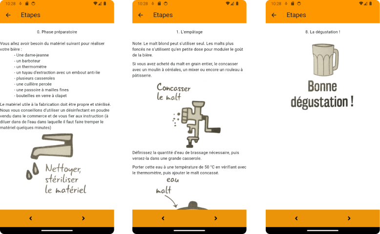

# BeerMaker

BeerMaker est une application codée en Flutter pendant ma deuxième année de BTS SIO option SLAM. 
Cette application permet d'apprendre à réaliser sa propre bière maison grâce à un tutoriel et un 
formulaire qui calcule la quantité nécessaire des différents ingrédients pour la réalisation.

## Fonctionnement

L'application démarre avec un écran d'accueil de 3 secondes, puis nous sommes redirigés vers la page d'accueil. 
Sur cette page, nous trouvons des boutons qui nous permettent d'accéder aux autres sections, à savoir les étapes de fabrication et l'outil de fabrication.

  

### Etapes de fabrication

Sur la page des étapes de fabrication, vous avez accès aux différentes phases de la fabrication de la bière. 
Toutes les étapes sont affichées à l'aide d'une structure de contrôle switch-case..

### Outil de fabrication

Sur la page de l'outil de fabrication, l'utilisateur a la possibilité d'entrer, à l'aide des champs d'entrée (inputs), 
la quantité de bière souhaitée en litres, le pourcentage d'alcool et la moyenne EBC des grains. 
En utilisant ces informations, nous pourrons déterminer la quantité nécessaire de tous les ingrédients pour notre bière ainsi que sa couleur.

## Les fichiers

### strings.dart

Le fichier strings.dart contient l'ensemble du texte qui est affiché pour les étapes de fabrication. 
Il offre la possibilité, si besoin, de traduire le texte, permettant ainsi à l'application d'être accessible dans plusieurs langues.
