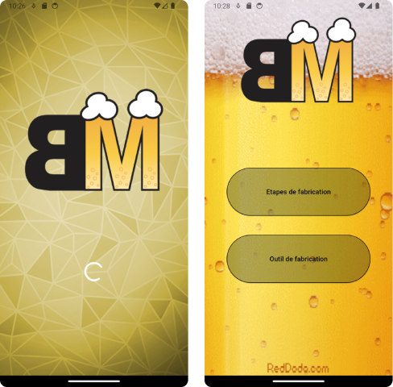

# BeerMaker

BeerMaker est une application codée en Flutter pendant ma deuxième année de BTS SIO option SLAM. 
Cette application permet d'apprendre à réaliser sa propre bière maison grâce à un tutoriel et un 
formulaire qui calcule la quantité nécessaire des différents ingrédients pour la réalisation.

## Fonctionnement

L'application démarre sur un splash Screen de 3 s, on est ensuite redirigé sur la page d'accueil sur laquelle se trouvent les boutons pour accéder 
aux autres pages soit les étapes de fabrication ou l'outil de fabrication .

  

### Etapes de fabrication

Sur la page d'étapes de fabrication, vous avez accès aux différentes étapes de fabrication de la bierre.
Toutes les étapes sont affiché à l'aide d'un switch case.

### Outil de fabrication

Sur la page outil de fabrication l'utilisateur à la possibilité de rentré à l'aide des inputs
la quantité de bière voulu en L , le pourcentage d'alcool et la moyenne EBC des grains.
A l'aide de ces informations nous aurons la quantité de tout les ingrédiants nécessaire à notre bière ainsi que sa couleur.

